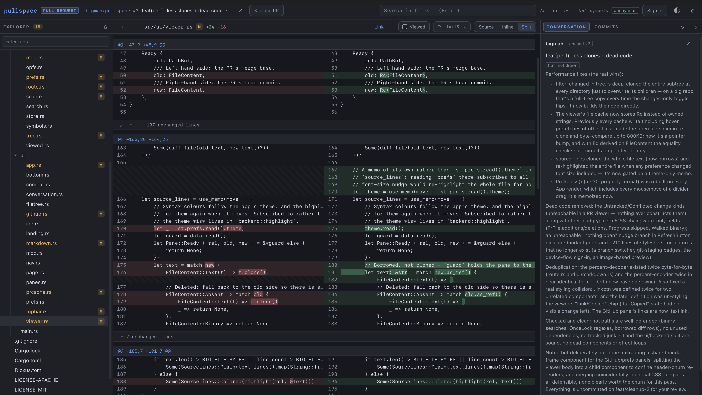

# pullspace

An IDE-style code reviewer written entirely in Rust and compiled to WASM

It is a **static page**. An `index.html`, a `.wasm` and a `.js` — no server, no
backend, no account with anyone. The page talks to `api.github.com` from the tab
it is open in, because GitHub answers cross-origin requests.




Two panes, like a traditional IDE but without the weight:

- **Left** — the file tree of the repository at the pull request's head commit,
  with badges marking changed files: `M` modified, `A` added, `D` deleted, `R`
  renamed. Directories containing changes get a dot and auto-expand. The `Δ`
  button filters the tree down to changed files only.
- **Right** — source viewer. Any file opens with full syntax highlighting;
  changed files open as diffs against the merge base, viewable **side-by-side
  (Split)** or **unified (Inline)**, both with word-level change emphasis. The
  unchanged stretches between changes arrive folded: the bar standing in for one
  opens it twenty lines at a time from either end, or all at once, and folds it
  back up again — `Reset` puts the whole file back the way it arrived. Markdown
  opens as the prose it is, with **Source** one button away.

Above the code is the strip of **files you have open**. Following a definition
three files away used to cost you the file it was called from; now that one
stays open beside it, one click back — and it comes back as you left it: the
same view, the same line picked out of it, scrolled to the same place. One tab
per file however many times it is opened, named by the file and by as much of
the path in front of it as it takes to tell two `mod.rs` apart, and coloured by
what the change does to it. `×`, a middle click or `⌥W` puts one down and hands
the pane to the file beside it. The strip holds a dozen; past that the one
nobody has been back to for longest is let go.

A third pane holds the **conversation**: the description, the discussion, the
review summaries and the comments left on lines of the diff, merged into one
list in the order they were written. Bodies are drawn as the markdown they are
— headings, lists, tables, and fenced code with the same highlighter the viewer
uses — through the renderer described under [Markdown](#markdown), so nothing
anybody wrote on the pull request is ever handed to this page as markup. Beside
it, **COMMITS** is the other half of the same pane: every commit on the branch,
oldest first, each one its subject line, its author and its short SHA. Clicking
one puts *that commit's* diff in the two panes — what it changed, against the
commit before it — while the list stays where it is, so a branch can be read the
way it was written, one commit at a time.

A repository opened on its own has no discussion, and **BRANCHES** takes the
conversation's place at the head of that pane: every branch it has, with the
commit at the tip of each — and a filter box over the list once there are more
than eight. Opening one reads the repository as that branch has it, carrying the
file you were on across wherever that branch still has it, and the branch is
written into the address bar as `#/owner/repo/tree/<branch>`, so a link to one is
a link somebody else can open.

`⇄` on a branch row is the other thing to do with one: hold it up against the
branch you are reading. That opens **a comparison** — `base...head`, three dots,
the same one github.com's compare page shows — and it is a pull request in
everything but name: the changed files badged in the tree, every diff read
against where the two last agreed, the commits between them in the pane, and
each of those openable as its own diff. The bar says how the two stand (`5
commits ahead`, `3 ahead · 12 behind`, `identical`) and `⇄` there turns the
comparison around. It has a link of its own too —
`#/owner/repo/compare/main...feat/thing` — and a pasted github.com compare URL
opens it, `owner:ref` cross-fork form included. Walking down the branch list
from an open comparison holds each branch against the same base in turn, which
is what comparing branches actually looks like. **COMMITS** beside it is then that branch's
history rather than a pull request's — newest first, a hundred at a time, with
*Show older commits* at the foot for the ones behind them — and every row of it
opens as a diff the same way. Reading a branch commit by commit is the same
clicking down the same list, with or without a pull request around it.

**CHECKS** is the third heading on that pane: what ran against the commit on
screen — the check runs and the older commit statuses in one list, failures
first, each with a tick, a cross or a pulsing dot, the app that ran it and how
long it took. The line at the top is the whole commit's verdict, and the count
beside the heading wears its colour, so a red number is the answer before the
tab is opened. Opening a check unfolds what it wrote: its report, drawn as the
markdown it is, and every line it marked up — the compiler errors, the failed
assertions, the lints. Each of those names a file and a line **and is a link to
it**, which is the point of having them in here rather than on a web page: a
failing test is one click from the code that failed it.

A panel across the bottom of the code holds the answer to "where else is this?"
— search hits, references, definitions — and closes again once it has been read.

## Running it
```sh
cargo install dioxus-cli --version 0.6.3 --locked   # once, for `dx`

dx build --platform web --release
```

## Development

```sh
cargo test      # the pure logic — diff model, markdown, tree, search, parsing
cargo check     # host target, which is what `cargo test` builds
cargo check --target wasm32-unknown-unknown   # what actually ships
dx build --platform web --release
```

## Signing in (Private repos)

Paste a token. That is a constraint rather than a shortcut: GitHub's OAuth
endpoints — `github.com/login/device/code` and `/login/oauth/access_token` —
send no CORS headers, so no page may call them, and the web flow additionally
needs a client secret, which means a server holding it. Every OAuth route ends
at infrastructure somebody has to run and everybody has to trust with their
tokens.

A pasted token has neither problem. It is kept in `localStorage` on the origin
serving the page, and it is sent to `api.github.com` and nowhere else. You can
confirm that in the network tab.

- A **fine-grained** token needs read access to *Contents*, *Pull requests* and
  *Metadata* — and, for the Checks tab on a private repository, *Checks* and
  *Commit statuses*, which are the two endpoints it reads.
- A **classic** token needs `repo`.

Make one at <https://github.com/settings/personal-access-tokens/new>.
*Sign out* removes it from storage.

**Without a token, public repositories still work** — the panel opens straight
onto the picker, signed in or not. File contents come from
`raw.githubusercontent.com`, which is not metered, so only metadata — the PR
list, the file list, the repo tree — spends GitHub's anonymous allowance of 60
requests an hour, and a tree read once is read off the disk after that. A token
raises the allowance to 5000 and reaches private repositories.

Repository *search* is metered separately and much harder: **10 a minute signed
out**, 30 with a token. Answers already seen are remembered for as long as the
panel is open, so backspacing through a name costs nothing, but running it out
is easy — it refills within the minute, and typing a full `owner/name` or
pasting a link goes to the hourly budget instead and keeps working meanwhile.

## The local copy

What is downloaded stays downloaded. Files are kept in the browser's **Origin
Private File System** — a real filesystem, private to the site, with none of
`localStorage`'s 5 MB ceiling — and they are filed under the **git blob hash**
of their contents rather than under a commit.

That is what makes the second visit cheap. A pull request opened next week has
a head commit that did not exist today, but nearly every file in it hashes to
what it hashes to now, so opening it downloads the handful of files that
actually differ and reads the other few thousand off the disk. The same goes
for the base side of every diff, for a second pull request on the same
repository, and for `⟳` after a push.

The GitHub panel says how much is stored and has a **Clear** button. Nothing is
sent anywhere: the store is per-origin, so it is readable by this page and by
nothing else, exactly like the token.

A clone runs in the background and gets out of the way of the person it is for:
it stands aside whenever a file is being opened, since both go through the same
filesystem and it has thousands of files in hand where the reader has one, and
it gives the browser a turn every couple of dozen files so the tree still
scrolls while it works. Hovering a row still warms it — but only when it is not
already here, which after the first minute it usually is.

Left to itself it stays under **1 GB**. Past that, the repositories you have not
opened in the longest are dropped, and every file no remaining repository refers
to goes with them. Files over 1 MB and the ones the viewer would only call
binary — images, archives, fonts, compiled objects — are not downloaded up
front; opening one, or reading a document that shows one, fetches it then.

## Markdown + HTML

Markdown files open **drawn**: headings, lists, tables, block quotes and task
boxes, with fenced code run through the same syntax highlighter as the source
view. `Source` shows the file exactly as written, and the two swap without
reloading anything.

Links work. An outside one opens in a new tab; one pointing at a file in the
repository opens it in this viewer, resolved relative to the document it is
written in — so a README that links to `docs/design.md` is a way around the
repository rather than a dead end.

Pictures are drawn — the ones the repository holds. `` is
read out of the repository like any other file, off the local copy where it is
already there, and carried into the document as a `data:` URL. There is no
server here to have served it from, and pointing an `` at
raw.githubusercontent.com would only work for repositories that are public.

A picture hosted somewhere else — a shields.io badge, a screenshot on a CDN —
is deliberately *not* fetched, and shows its alt text with a link to itself
instead. The same renderer draws pull request comments, and a comment is text a
stranger wrote: an `` in one is a request to whatever host it names, from
the tab holding your token, saying who read the pull request and when. GitHub
proxies those through camo for exactly that reason, and a static page has
nothing to proxy with.

What is *not* drawn is anything the file smuggles in as HTML. The bar says
`raw HTML not drawn` when a file contained some — including an `` written
that way, which is worth knowing if your README centres its screenshots in a
`<div>`.

The conversation pane goes through the same renderer, at the size of the column
it is in — which is the answer to the obvious worry about drawing text that
anybody with a GitHub account can write on a pull request. There is no HTML
path to attack: the parse produces blocks and styled runs, the viewer builds
elements out of them, and a comment that was mostly a `<details>` block says
`html not drawn` under it rather than quietly losing half of itself.

HTML files get a **Preview** that is the real page, rendered in an `iframe` with
an empty `sandbox` — no scripts, no forms, no navigation, and no same-origin
access, so a previewed file cannot reach the token in local storage. Its
pictures are carried in the same way: every `src` naming a file in the
repository is swapped for the file itself before the frame is handed anything,
since a relative path in there has no server to resolve against either.

## Architecture

```
src/
  main.rs           one launch
  backend/          UI-agnostic engine
    mod.rs          FileContent: one side of a diff
    http.rs         one GET, on the browser's fetch
    github.rs       GitHub REST: repo search, PRs, branches, commits, trees, blobs
    auth.rs         the token, and localStorage
    store.rs        localStorage: what a desktop app would put in ~/.config
    route.rs        what is open: a PR, a commit, a branch or a comparison
    prefs.rs        theme, accent, font and size, as a `:root` stylesheet
    clip.rs         the clipboard, for the link to a line
    viewed.rs       which files have been ticked off, by blob hash
    opfs.rs         the browser's filesystem, as bytes in and bytes out
    blobs.rs        the local copy: blobs by content hash, manifests, sweeping
    clone.rs        pulling a whole commit down, and reading files back out
    scan.rs         reading a commit back out of the store, and the text cache
    search.rs       patterns, and the lines that match them
    symbols.rs      where things are defined, by regex per language
    layout.rs       pane sizes, kept between visits
    tree.rs         file-tree model built from a path list + change statuses
    difftool.rs     hunk/line/segment diff model (similar), split-row pairing
    highlight.rs    syntect syntax highlighting (pure-Rust fancy-regex build)
    markdown.rs     markdown parsed to blocks and styled runs (no HTML)
    images.rs       pictures as data: URLs; the `src`s a page asks for
  ui/               Dioxus components
    app.rs          state (signals + context), root layout
    compat.rs       sleep, on the browser's event loop
    github.rs       sign-in, repository search, pull request picker overlay
    prcache.rs      what is decoded in memory, and what warms it
    imgcache.rs     pictures read on demand, and what is kept of them
    topbar.rs       what is on screen, warm-up progress, account, refresh
    filetree.rs     recursive tree with status badges
    viewer.rs       source view, inline & split diff views
    tabs.rs         the files held open, and where each one is scrolled to
    ide.rs          search, definitions, references, and the keyboard
    nav.rs          the address bar read back: links, Back and Forward
    bottom.rs       the panel under the code: hits, definitions, a peek at one
    markdown.rs     markdown drawn as elements; link targets, pictures
    conversation.rs the pull request's description and comments, drawn
    prefs.rs        the appearance panel
    page.rs         the browser tab: its name, and the icon on it
    panes.rs        draggable dividers
```

One crate, one target, and no `#[cfg(target_arch)]` anywhere in it. Everything
is pure except `http.rs`, `store.rs`, `opfs.rs`, `route.rs`, `clip.rs` and the
`open_browser` in `auth.rs` — the six places that touch the browser at all.
Nothing in the test suite reaches any of them, which is what keeps `cargo test`
running on the host.

`cargo test` still runs natively: the gloo/web-sys crates compile for the host
even though their calls only work in a page, and everything with tests — the
diff model, highlighting, markdown, the tree, search patterns, the symbol
patterns, URL parsing — is pure.

## Notes & limits

- The clone is one request per file, because a page cannot do it in one:
  `github.com`'s smart-HTTP endpoints send no CORS headers, and `codeload`
  answers archive requests only to GitHub's own origin, so neither the git
  protocol nor the tarball can be had from a browser tab. What can is
  `raw.githubusercontent.com`, which answers anybody and is not metered — so a
  public repository costs bandwidth and none of the API's hourly allowance,
  whether or not you are signed in. Private repositories have no CDN and are
  read through the API's blob endpoint, one request of the hour's 5000 each,
  which is why cloning one is worth doing exactly once.
- Diffs are merge-base vs head, which is the comparison GitHub's "Files
  changed" tab shows — and a comparison between two branches is the same three
  dots, so what it shows is what the right-hand side *adds* rather than every
  way the two differ right now. A branch that is only behind therefore compares
  to nothing, and the bar says so rather than showing an empty diff.
- A comparison covers at most 300 files, which is GitHub's own limit on that
  endpoint. Its commits arrive with it — the first hundred, free, in the same
  answer — and it says how many there are in all.
- The Checks tab shows what GitHub *says* about a run, not the run's output:
  the conclusion, the report the check wrote, and the lines it marked up. The
  raw step log is not among them, and cannot be — that endpoint needs a token
  even on a public repository, and answers with a redirect to a storage host
  that sends no CORS headers, so no page may read the body however it asks.
  `↗` on a row opens the log on github.com, which can.
- Checks are read for the commit on screen, so stepping into a commit from the
  COMMITS tab asks again for that commit — which is the honest answer, since a
  check is a fact about a commit and not about the branch.
- A branch is browsed, not diffed: nothing in the explorer is marked as changed,
  because a branch is not a comparison. Its commits are, one at a time.
- The branch list is the first 300 GitHub answers with, in its own order, which
  is by name — the only order that is free: sorting by when each was last pushed
  to would be a request per branch. On a repository with thousands of them that
  is a beginning rather than the whole (microsoft/vscode has some forty-eight
  hundred), so the box over the list stops being a filter and becomes a search:
  what is typed narrows the rows here **and** goes to GitHub's ref index for the
  ones past them. That index matches from the start of a name and letter for
  letter, so a fragment from the middle finds nothing and `dileepy` will not
  find `DileepY/1.109` — the pane says so where it would otherwise read as "no
  such branch". A branch's history arrives a hundred commits at a time, one
  request each; a pull request's arrives whole, up to GitHub's own limit of 250.
- Branches are the open repository's own. A branch that lives on a fork is on
  that fork — open it as the repository it is.
- The top bar flags a partial explorer: `truncated` (over GitHub's 3000-file
  cap per PR), `partial tree` (repo past GitHub's recursive-tree limit, about
  100k entries or 7 MB), or `changed files only` (the tree could not be read at
  all).
- Highlighting and diffing run on the browser's single thread. Files over
  ~400 KB / 6k lines render without highlighting for speed; binary files are
  detected and not rendered.
- Search, Go to Definition and Find References read the local copy rather than
  GitHub, so they cover what was downloaded and say what they missed. The index
  behind the last two is regular expressions per language and not a compiler:
  right nearly always within one file, a very good guess across a repository,
  and it offers the list when a name is defined more than once.
- The index waits for the download to finish before it starts, since both go
  through the same filesystem. On a large repository the first Go to Definition
  of a session may arrive a moment after the code does.
- A link carries the file and the line, but not the mode: it opens as source at
  that line, because that is the one form every file has. A line of a diff is
  therefore two clicks away — `Inline` or `Split` keeps the line lit.
- Appearance is per browser, like everything else here: a theme is `localStorage`
  on this origin, not an account setting, and a fresh browser starts on Dark.
  The code fonts on offer are the ones your operating system already ships, and
  are named for it — a page cannot install a font, and none is bundled, so
  offering one you do not have would be a button that changes nothing.
- Viewed marks are per browser, like everything else here. They are yours, not
  the pull request's — nothing is written back to GitHub, so the boxes you tick
  are invisible to it and to everybody else on the review.
- There is no local mode: pullspace reviews GitHub, it does not diff your
  working tree.

## License

Dual-licensed under either of

- Apache License, Version 2.0 ([LICENSE-APACHE](LICENSE-APACHE) or
  <https://www.apache.org/licenses/LICENSE-2.0>)
- MIT license ([LICENSE-MIT](LICENSE-MIT) or
  <https://opensource.org/licenses/MIT>)

at your option.

Unless you explicitly state otherwise, any contribution intentionally submitted
for inclusion in this work by you, as defined in the Apache-2.0 license, shall
be dual-licensed as above, without any additional terms or conditions.
